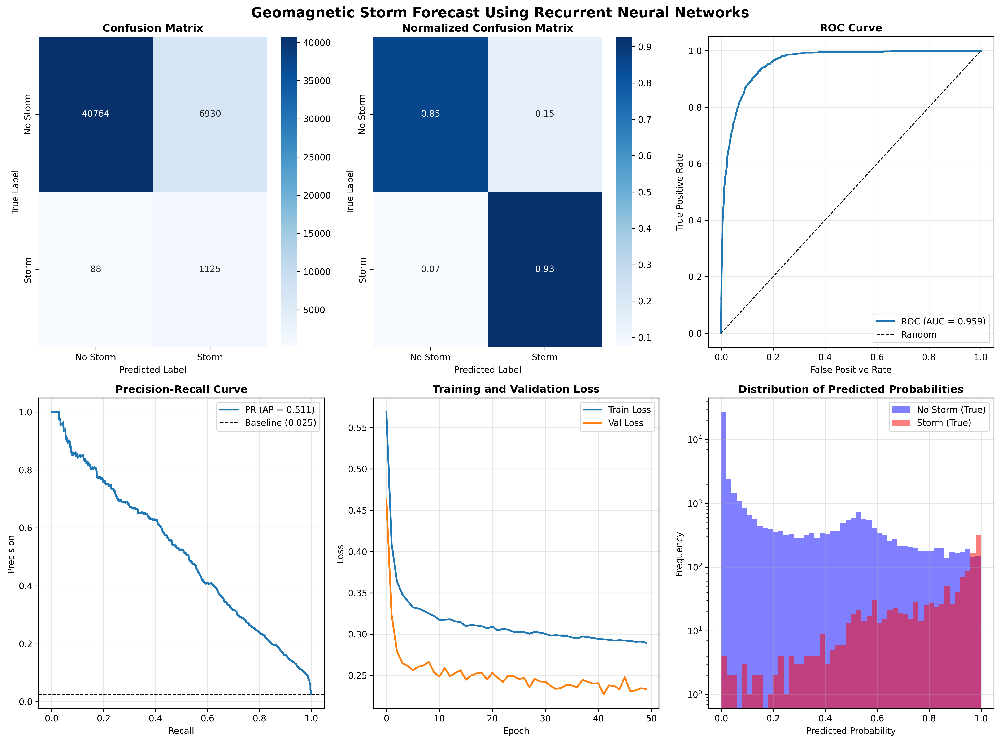

# hbr-solar-forecast-project

## Overview
I developed this project as the final activity of the first phase of the course Residência em Tecnologias Aeroespaciais - Inteligência Artificial offered by Instituto Hardware BR, applying what I learning in the course to solve an aerospace problem.

I choose [space weather](https://en.wikipedia.org/wiki/Space_weather) forecasting, especially the forecast of [solar flares](https://en.wikipedia.org/wiki/Solar_flare) and [geomagnetic storms](https://en.wikipedia.org/wiki/Geomagnetic_storm), as space weather can considerably impact communications, the electrical grid, and satellites.

## What the code does

### 1. Downloading the data

I wrote scripts to access and download data from two main sources:

* [PySPEDAS](https://pyspedas.readthedocs.io/en/latest/index.html), a Python library that offers many types of data from the Sun. I used it for:
  * [GOES](https://pyspedas.readthedocs.io/en/latest/goes.html), to access data of the [GOES](https://www.ospo.noaa.gov/operations/goes/) satellites missions.
  * [OMNI](https://pyspedas.readthedocs.io/en/latest/geomagnetic_indices.html#omni-solar-wind-and-magnetospheric-indices), to access data from many different instruments and missions.
* [DRMS](https://docs.sunpy.org/projects/drms/en/stable/), a Python library to access a variety of spaceweather quantities. I used it for [SHARP](http://jsoc.stanford.edu/doc/data/hmi/sharp/sharp.htm).

And I used a dataset available at Kaggle:

* [Solar + Geomagnetic Indices: EDA](https://www.kaggle.com/code/erevear/solar-geomagnetic-indices-eda/input?select=daily_solar_data.csv).

The scripts are in the [downloaders](https://github.com/ferdesmello/hbr-solar-forecast-project/tree/main/downloaders) folder.

#

### 2. Cleaning the data

The datasets have many null values, windows of no data, or the data were taken at different time paces. I cleaned and merged the datasets into two: one for the solar flares () and one for the geomagnetic storms ().

The cleaning scripts are in the [filters](https://github.com/ferdesmello/hbr-solar-forecast-project/tree/main/filters) folder.

#

### 3. The models

The goal is to predict the presence or absence of flares or storms in the next day (flare) or hour (storm) based on the last three days (flare) or hours (storms). I used each dataset to train 4 types of models:

* Random Forest (RF).
* Support Vector Machine (SVM).
* Neural Network (NN).
* Recurrent Neural Network - Gated Recurrent Unit (RNN-GRU).

I had to shape the datasets a bit to fit the use in each model, but it was a small change, mostly separating features from target, standardizing features using a scaler, and creating new lagged features.

The models are in the [forecasters](https://github.com/ferdesmello/hbr-solar-forecast-project/tree/main/filters) folder.

#

### 4. The figures

For each model, I made a set of figures showing metrics and results.

The figures are in the [figures](https://github.com/ferdesmello/hbr-solar-forecast-project/tree/main/filters) folder.

An example of a resulting figure for the geomagnetic storm RNN-GRU model:

